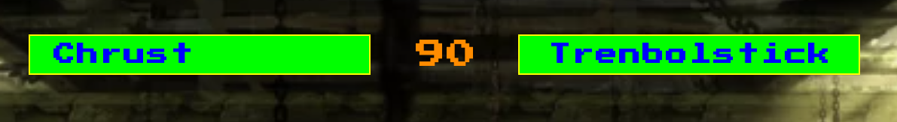
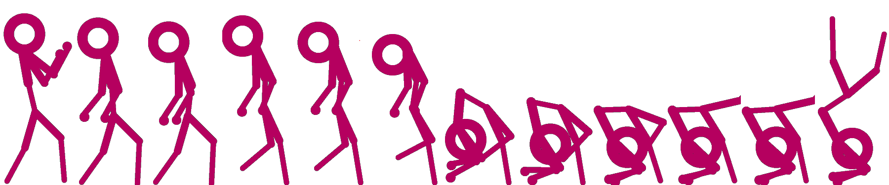
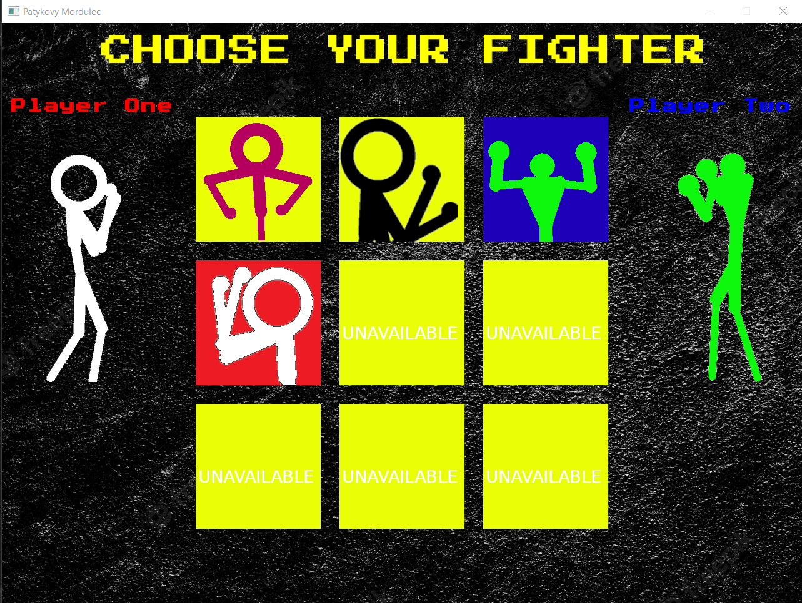
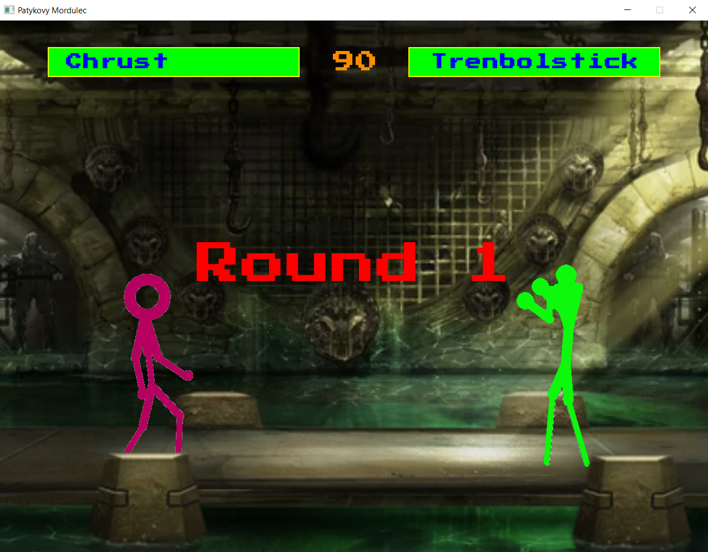

# 1. Temat projektu

Celem projektu było odtworzenie pierwszej części z popularnej serii gier automatowych - "Mortal Kombat", wraz z wykorzystaniem nowoczesnych technik programowania w języku C++ (omawianych na laboratoriach) oraz metodyki obiektowej. Projekt przyjął żartobliwą nazwę "Patykovy Mordulec". Realizowany był w dwuosobowym zespole.

# 2. Analiza tematu

Zadanie wymaga sprawnej realizacji wielu aspektów tworzenia gry komputerowej. Dodatkowo praca musi być w miarę możliwości równo podzielona pomiędzy 2 osoby. Najważniejsze zagadnienia:

## 2.1 Podstawowy silnik gry

Konieczne jest utworzenie slinika pozwalającego na wyświetlanie dwuwymiarowych grafik. Powinien on również wspierać obsługę prostej fizyki, detekcję kolizji oraz dać możliwość implementacji wymaganych nowoczesnych bibliotek języka C++.

## 2.2 Interfejs i nawigacja

W celu oddania stylu realizacji menu oraz interfejsu orygninalnego wzorca, należy pozostawić sterowanie nawigacją klawiaturze. Menu wyboru postaci oraz ekrany kończące pozostać mają proste i przejrzyste.

## 2.3 Kluczowe aspekty rozgrywki

Odwzorowane mają zostać najważniejsze aspekty gry typu bijatyka, takie jak poruszanie, skakanie, wyprowadzanie różnorodych ciosów, blokowanie czy uniki. Dodatkowo gracze mają mieć możliwość wyboru postaci, które różnić będą się nie tylko wyglądem ale również zestawem ruchów oraz powiązanym z nim "stylem walki".

## 2.4 Cykl trwania meczu

Każdy mecz podzielony zostanie na niezależne rundy. Po rozpoczęniu rozgrywki czas do zakończenia rundy pozostanie ograniczony. Rudna trwać będzie do momentu, aż któremuś z graczy skończą się punkty zdrowia, lub do upłynięcia czasu. Mecz kończy się w momencie wygrania przez jednego z graczy 2 rund. 

## 2.5 Elementy GUI

Na ekranie gry poza samymi postaciami znajdować będą się ulokowane w stałych miejscach elementy Graficznego Interfejsu Użytkownika. Będą to między innymi paski, reprezentujące ilość posiadanych punktów zdrowia każdego z graczy oraz licznik czasu rundy. Ich wygląd również wzorowany będzie na oryginalnej inspiracji.

||
|:--:|
| **Rys. 1: Finalna wersja głównych elementów GUI**|

## 2.6 Treści i zawartość

Poza typowo technicznymi aspektami, projekt zakłada dodanie do napisanej gry podstawowych zawartości. W celu oddania oryginalnej oprawy graficznej rysowane elementy, takie jak grafiki postaci lub areny wyglądem będą przypominały grę retro.

Dodatkowo utworzone będą oryginalne postacie, wraz z pasujacymi do ich wyglądu zestawami ruchów. Same postacie będą musiały przejść przez proces optymalizacji oraz balansowania, w celu zapewnienia sprawiedliwej i zajmującej rozgrywki.

||
|:--:|
| **Rys. 2: Klatki animacji ataku jednej z postaci**|

## 2.7 Optymalizacja

Gry z gatunku bijatyka mocno opierają się na szybkich reakcjach graczy. Z tego powodu płynna i responsywna rozgrywka jest wyjątkowo istotna. Wymagane jest, aby silnik posostawiał wiele miejsca na optymalizację. Ważne jest unikanie czasochłonnych operacji oraz sprawna identyfikacja punktów krytycznych.  

## 2.8 Biblioteki zewnętrzne

W celu realizacji podstawowych elementów silnika oraz rozgrywki zdecydowano się wykorzystać bibliotekę Simple and Fast Multimedia Library. Pozwala ona na proste wprowadzanie wielu istotnych mechanik, takich jak wczytywanie i wyświetlanie grafik, operacje związane z liczeniem czasu lub detekcję kolizji.


# 3. Specyfikacja zewnętrzna


## 3.1 Uruchamianie
Program można uruchomić z linii poleceń, lub klikając dwukrotnie na plik wykonywalny programu. 

## 3.2 Ekran wyboru postaci

Po uruchomieniu, wyświetla się ekran powitalny, który po 5 sekundach przechodzi do ekranu wyboru postaci - menu.  

||
|:--:|
| **Rys. 3: Ekran wyboru postaci**|

Gracze mogą wybierać spośród 4 unikalnych postaci, za pomocą klawiszy *WSAD* oraz *IKJL*. Portrety aktualnie wybranych postaci posiadają odpowiednie kolory tła, dla gracza pierwszego czerwone, a dla gracza drugiego - niebieskie. Oprócz tego, po lewej i prawej stronie ekranu wyświetlana jest animacja, w której biorą udział aktualnie wybrane postacie.

Aby zakończyć etap wyboru postaci i przejść do rozgrywki, gracz pierwszy powinien wcisnąć i przytrzymać klawisz *TAB* a gracz drugi, klawisz *ENTER*.

## 3.3 Ekran ładowania

W czasie ładowania się gry (wczytywania z pliku tekstur poszczególnych postaci i ataków) wyświetlany jest odpowiedni ekran, prezentujący postępy. Ponieważ wczytanie gry odbywa się bardzo szybko, na nowoczesnych komputerach ekran ładowania nie zostanie raczej w ogóle zauważony przez użytkownika.

## 3.4 Rozgrywka

Właściwy mecz rozpoczyna się od wyświetlenia numeru rundy, oraz komunikatu tekstowego oznaczającego początek walki ( *Fight!* ). Dopiero po zniknięciu tekstu, możliwe jest poruszanie się postaciami, wtedy też odliczanie rozpoczyna zegar. 

||
|:--:|
| **Rys. 3: Ekran rozgrywki**|


### 3.4.1 Zegar

Każda z rund trwa 90 sekund, po upływie tego czasu zwycięża gracz z większą ilością zdrowia.

### 3.4.2 Poruszanie się

Gracz pierwszy porusza się za pomocą klawiszy *WSAD* a drugi, za pomoca klawiszy *IKJL*. Klawisze *W* i *I* są odpowiedzialne za skok w górę. Klawisze *AD* oraz *JL* za poruszanie się odpowiednio w lewo i w prawo, a klawisze *S* i *K* za kucanie.

### 3.4.3 Blokowanie

Ataki mogą zostać zablokowane zarówno w pozycji stojącej jak i kucającej. Co ważne, atak wyprowadzony z dołu może zostać zablokowany tylko kucając, tak samo jak atak wyprowadzony z góry może zostać zablokowany tylko stojąc. Podczas blokowania nie można wykonać ataku. Aby wykonać blok, gracz pierwszy powinien nacisnąć klawisz *T*, a gracz drugi strzałkę w górę.

### 3.4.4 Atakowanie

Każda z postaci posiada unikalny zestaw ataków, aktywowanych różnymi kombinacjami klawiszy, dla gracza pierwszego *TGFH* oraz dla gracza drugiego strzałkami. Istnieją trzy rodzaje ataków, wyprowadzone z dołu, z góry i ze środka. Ma to znaczenie przy blokowaniu ataków, dlatego wykonanie ataku nie gwarantuje zawsze trafienia i odwrotnie, nieumiejętne zablokowanie może doprowadzić do otrzymania ciosu.

Każdy z ataków posiada własną animację, oraz liczbę klatek do jego aktywowania, w tym czasie gracz wykonujący narażony jest na kontrę. Istniejące w grze ataki podrzucające przeciwnika, można wykorzystać do rozpoczęcia sekwencji ataków, które nie mogą zostać powstrzymane, ze względu na brak możliwości sterowania podczas upadku i lotu.

### 3.5 Koniec rundy i meczu

Gdy zakończy się czas, lub jeden z graczy straci całe życie (pasek zdrowia wypełni się kolorem czerwonym) runda dobiego końca. Wyświetla się komunikat o zwycięzcy rundy i rozpoczyna się kolejna. Pod paskiem zdrowia gracza, który wygrał rundę pojawia się złote koło, informujące o jednym zwycięstwie. Po dwóch wygranych rundach mecz dobiega końca, zostaje ogłoszony jego zwycięzca.

### 3.6 Powtórny mecz

Po zakończeniu meczu gracze mają możliwość rozpoczęcia nowego meczu z tymi samymi lub innymi postaciami, w zależności od klawisza *F2* lub *F3*, który zostanie wciśnięty. Jeśli chcą zakończyć rozgrywkę, wystarczy kliknąć klawisz *Escape*. Po zakończeniu meczu wyświetla się na ekranie komunikat, informujący o dostępnych opcjach.

# 4. Specyfikacja wewnętrzna

## 4.1 Diagram klas
Diagram klas, zgodny ze standardami UML, wraz z wydzielonymi odpowidzialnościami każdego z autorów, znajduje się w załączniku. 
Kolorem żółtym zaznaczono klasy zaimplementowane przez Jana Kocurka, a niebieskim przez Wojciecha Ptasia.
## 4.2 Wykorzystane nowoczesne biblioteki języka C++

### 4.2.1 Biblioteki menagera scen, wczytywania i GUI - Wojciech Ptaś

Do odczytu wszystkich ataków z pliku podczas wczytywania gry zdecydowano się wykorzystać bibliotekę *filesystem* w celu wygodnego iterowania się po danym folderze. Posłużono się w tym celu klasą *std::filesystem::directory_iterator*

```cpp
	...
	std::filesystem::path sandbox = s;
	for (const auto& dir_entry :std::filesystem::directory_iterator{ sandbox }) {
		std::filesystem::path sandbox = dir_entry;
		std::ifstream myFile(sandbox.string());
		...
	}
```

||
|:--:|
| **Fragment kodu wykorzystujący bibliotekę filesystem**|

W celu przyśpieszenia procesu wczytywania postaci obu graczy, zdecydowano się wykorzystać bibliotekę *thread* w celu wykonywania operacji wielowątkowo. Konieczne również okazało się wykorzystanie *std::future* w celu przechowania wyników operacji wykonywanych wielowątkowo. Ponadto, oba wątki wczytujące postacie sygnalizują ukończenie pracy za pomocą semafora. Wszystkie funkcje służące do obsługi tego procesu, umieszczono w module *AsyncLoading.ixx*.

```cpp
#include <thread>
#include <future>
#include "LoadingScreen.h"
export module AsyncLoading;

std::counting_semaphore<2> toLoad{ 0 };
export void LoadPlayer(std::promise<std::shared_ptr<Player>> & prom, std::string charName);
export void DisplayLoadingStatus(LoadingScreen* load);
void LoadPlayer(std::promise<std::shared_ptr<Player>>& prom, std::string charName)
{
	std::shared_ptr<Player> newPlayer = std::make_shared<Player>(charName);
	prom.set_value(newPlayer);
	toLoad.release();
	return;
}

void DisplayLoadingStatus(LoadingScreen* load)
{
	bool arebothLoaded = false;
	int loadingPercent = 0;
	while (!arebothLoaded) {
		if (toLoad.try_acquire()) {
			loadingPercent += 50;
			if (loadingPercent == 100) {
				arebothLoaded = true;
			}
		}
		load->update(loadingPercent);
		load->render();
	}

}
```
||
|:--:|
| **Fragment kodu wykorzystujący bibliotekę thread, future i moduły**|

Funkcja *LoadPlayer*, gdy zakończy swoje działanie, zwalnia semafor *toLoad*, dzięki czemu, funkcja *DisplayLoadingStatus* wie, ile graczy zostało już wczytanych. Wczytana postać, przechowywana jest w strukturze *std::promise*, dzięki czemu możliwe jest je odczytanie w głównym wątku.

```cpp

std::promise<std::shared_ptr<Player>> promPlayerOne;
	std::future<std::shared_ptr<Player>> loadedPlayerOne = promPlayerOne.get_future();
	std::promise<std::shared_ptr<Player>> promPlayerTwo;
	std::future<std::shared_ptr<Player>> loadedPlayerTwo = promPlayerTwo.get_future();
	std::thread th1(&LoadPlayer, std::ref(promPlayerOne), this->playerOneName);
	std::thread th2(&LoadPlayer, std::ref(promPlayerTwo), this->playerTwoName);
	DisplayLoadingStatus(this);
	th1.join();
	th2.join();
	this->playerOne = loadedPlayerOne.get();
	this->playerTwo = loadedPlayerTwo.get();
```
	
||
|:--:|
| **Wywołanie funkcji LoadPlayer z wykorzystaniem biblioteki thread**|


### 4.2.2 Biblioteki silnika, animatora oraz mechanik - Jan Kocurek

Korzystając z funkcjonalności *modules* standardu C++20 utworzono moduł `async_functions.ixx`. Zawiera on zestawy operacji, których wykonywanie jest niezależne od innych elmentów kodu. Dzięki temu można wykonywać je asynchronicznie, korzystając z funkcjonalności biblioteki standardowej `std::async`. Moduł ten importowany jest w miejscach wykorzystujacych operacje wielowątkowe.


```cpp
export module async_functions;

export void async_read_input(GameEngine* g);
export void async_move_players(std::shared_ptr<Player> p1, std::shared_ptr<Player> p2);
export void async_recovery(std::shared_ptr<Player> p);
export void async_animation(std::shared_ptr<Player> p);
export const bool update_view(GameEngine* g, std::shared_ptr<Player> p1, std::shared_ptr<Player> p2, std::shared_ptr<sf::View> view, const float& dist_between_players);
export void init_gameobject_variables(GameObject* gameObject);

module :private;
//ciała funkcji
```

||
|:--:|
| **Fragment kodu modułu**|

```cpp
std::thread animation_th_p1(async_animation, this->player1);
std::thread animation_th_p2(async_animation, this->player2);

animation_th_p1.join();
animation_th_p2.join();

```

||
|:--:|
| **Przykład zastosowania, fragment `GameEngine.cpp`**|

Dodatkowo, dwie z funkcji modułu wykorzystuje funkcjonalość `std::semaphore`. Elementy kalkulacji ruchu postaci oraz odczytywania wprowadzanej przez gracza kombinacji klawiszy wykonują się jednocześnie. W momencie, gdy odczyt jest gotowy, funkcja `async_read_input` zwalnia semafor, na który oczekuje funkcja `async_move_players`.

```cpp
void async_read_input(GameEngine* g) {
	g->updateInput();
	prepare.release();
}

void async_move_players(std::shared_ptr<Player> p1, std::shared_ptr<Player> p2) {
	bool can_p1_move = p1->canMove();
	bool can_p2_move = p2->canMove();
	prepare.acquire();

	if (can_p1_move) {
		p1->duck();
		p1->move();
		p1->jump();
	}
	if (can_p2_move) {
		p2->duck();
		p2->move();
		p2->jump();
	}
}
```

||
|:--:|
| **Omawiany fragment modułu**|

Kontener tekstur każdej z postaci przed wczytaniem inicializowany jest wartościami `nullptr`. Jeśli odczyt którejś z funkcji nie powiedzie się, w wielu miejscach zgłoszony zostać może błąd dostępu. W celu weryfikacji poprawnego odczytania tekstur wykrozystano funkcjonalość `std::ranges`.

```cpp
auto didLoad = [](const std::shared_ptr<sf::Texture> pointer) { return pointer == nullptr; };
for (const auto& val : std::views::values(this->playerTextures) | std::views::filter(didLoad)) {
        std::cout << "PLAYER::initTexturesMap() CRITCAL ERROR: nullptr in map!\n";
}
```

||
|:--:|
| **Zastosowanie biblioteki `ranges`**|

# 5. Testowanie
 Program był wielokrotnie uruchamiany i rozgrywany różnymi dostępnymi postaciami. Ponadto, pojedyncze komponenty były testowane jednostkowo. Zwrócono szczególnie uwagę na możliwe błędy występujące przy wcisnięciu wielu klawiszy na raz lub w momencie zmiany stanu postaci, takie jak na przykład kucanie postaci podczas skoku. Wykryte nieprawidłowści zostały skutecznie wyeliminowane, w czym bardzo przydatne było zastosowanie uproszczonej maszyny stanów dla pozycji gracza.
 
 Program został sprawdzony pod kątem wycieków pamięci, jednak dzięki zastosowaniu wskaźników typu *smartpointery*, w programie nie znajdują się wycieki pamięci, oprócz tych, wynikających z właśności samej biblioteki *SFML*, która posiada wycieki pamięci, przez sterowniki kart graficznych.
 
# 6. Uwagi i wnioski

## 6.1 Praca zespołowa i organizacja
Elementem który pozowlił utrzymać wysoką produktywność oraz uniknąć wielu kłopotów podczas późniejszych faz realizacji projektu było przykładne i konkretne podzielenie się obowiązkami oraz ustalenie wspólnej wizji produtku końcowego w pierwszej fazie pracy zadaniem. Praca została rozłożona w taki sposób, aby obydwie osoby pracujące nad projektem nie przeszkadzały sobie nawzajem. Tworzone komponenty pozostały mało zależne od siebie, a interfejsy kompatybilne. W ten sposób mogły być tworzone, testowane i modyfikowane jednocześnie bez wzajemnego utrudniania pracy.

Wyjątkowo przydatne okazało się korzystanie z systemu kontroli wersji GIT. Umożliwił on bezproblemową współpracę nad kodem oraz pomógł lepiej kontrolować historię pisanego kodu.

## 6.2 Kłopotliwe aspekty produkcji gier

Podczas realizacji projektu napotkano kilka problemów. Najczęstszym z nich, było błędne oszacowanie czasu potrzebnego do ukończenia konkretnych aspektów projektu. Elementy takie jak animowanie, tworzenie interaktywnego menu, czy kreacja postaci okazały się zaskakująco czasochłonne. Jednocześnie silnik, fizyka lub wczytywanie danych z plików zostały ukończone o wiele szybciej niż zakładano. Sytuacja ta dobrze obrazuje, jak cenne podczas produkcji każdego złożonego programu jest doświadczenie jego twórców.

Tworzenie komponentów, z którymi już kiedyś zetknięto się podczas programowania, okazywały się zdecydowanie prostsze niż te, charakterystyczne dla gier komputerowych, z którymi nasz dwuosobowy zespoł nie miał dużego doświadczenia od strony deweloperskiej.

## 6.3 Nowoczesne biblioteki języka C++

Zastosowanie w projekcie nowoczesnych bibliotek znacznie pomogło zrozumieć i utrwalić wiadomości z laboratoriów. Wyjątkowo przyjemne i mało problematyczne okazało się korzystanie z funkcjonalości pozwalających na asynchroniczne wykonywanie kodu, takich jak `std::thread` czy `std::semaphore`. Istotnym jednak przy ich stosowaniu było wybieranie odpowiednich fragmentów kodu do asynchronizacji. Jeśli rozdzielana pomiędzy wątki operacja była zbyt mało czasochłonna, czas alokacji nowego wątku oraz łączenia go z głównym okazywał się większy, od czasu zyskanego na wielowątkowym wykonaniu operacji. Asynchroniczność najlepiej sprawdzała się w sytuacjach, gdy pracowano na niezwiązanych z sobą fragmentach programu (jak wczytywanie postaci). Również metody synchronizacji okazały się bardzo proste w implementacji, co dowodzi że język C++ w istocie należy do rodziny języków wysokopoziomowych.

Najbardziej problematyczne okazało się korzystanie z modułów. Poza znacznym wydłużeniem czasu kompilacji i wykonywania kodu, ich użycie powodowało problemy z działaniem funkcji *IntelliSense* edytora *Visual Studio*, co znacznie utrudniało pracę nad programem. Pozostaje mieć nadzieję, że ta funkcjonalność ze standardu C++ 20, zostanie w przyszłości dobrze zaimplementowana, gdyż ma naprawdę spory potencjał, co udowadnia popularność modułów w innych językach programowania.

Funkcjonalność `std::ranges` znacznie poprawiła czytelność kodu wykonującego operacje na kontenerze `std::map`, nawet jeśli nie poprawiła czasu wykonywania operacji. Użycie biblioteki `filesystem`, znaczenie uprościło operowanie na całych folderach, ciężko jest sobie wyobrazić projekt pracujący na plikach, nie korzystający z tej biblioteki.